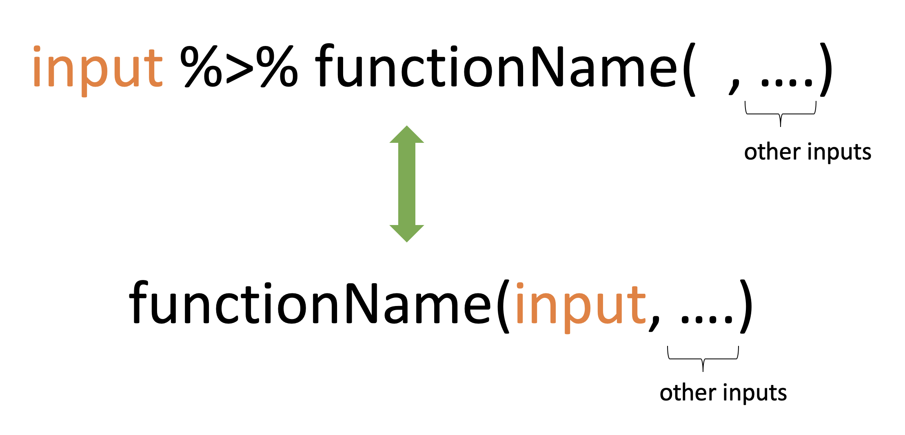

# Introduction to dplyr
Reiko Okamoto
2025-09-24

## 👋 Welcome to the tidyverse

### What is the tidyverse?

The [tidyverse](https://www.tidyverse.org/) is a collection of R
packages for data science. Today, we will be using
[`dplyr`](https://dplyr.tidyverse.org/) for data manipulation and
[`ggplot2`](https://ggplot2.tidyverse.org/) for data visualization.

### Why learn it?

Many concepts you learn with the tidyverse (e.g., creating plots,
filtering data) translate to other programming languages like Python and
SQL. This foundation helps you pick up those languages more quickly
later. The tidyverse also allows you analyze data in a transparent and
reproducible way, so others can easily follow how you reached your
conclusions.

### Keep in mind…

Please don’t feel like you need to memorize everything! Even experienced
data scientist don’t know everything off the top of their heads. My main
goal today is to pique your interest in using the tidyverse for data
analysis.

## 🐧 Palmer penguins


We’ll use the `penguins` data set from the
[`palmerpenguins`](https://allisonhorst.github.io/palmerpenguins/)
package. It contains measurements for adult penguins observed in a group
of islands off the coast of the Antarctic Peninsula. The data were
collected and made available by Dr. Kristen Gorman and the Palmer
Long-Term Ecological Research (LTER) program. This data set is concise
but offers a diverse mix of data types and features, making it an
excellent resource for learning the tidyverse.

#### *Load packages*

``` r
library(tidyverse)
```

    ── Attaching core tidyverse packages ──────────────────────── tidyverse 2.0.0 ──
    ✔ dplyr     1.1.4     ✔ readr     2.1.5
    ✔ forcats   1.0.0     ✔ stringr   1.5.1
    ✔ ggplot2   3.5.2     ✔ tibble    3.3.0
    ✔ lubridate 1.9.4     ✔ tidyr     1.3.1
    ✔ purrr     1.1.0     
    ── Conflicts ────────────────────────────────────────── tidyverse_conflicts() ──
    ✖ dplyr::filter() masks stats::filter()
    ✖ dplyr::lag()    masks stats::lag()
    ℹ Use the conflicted package (<http://conflicted.r-lib.org/>) to force all conflicts to become errors

``` r
library(palmerpenguins)
```


    Attaching package: 'palmerpenguins'

    The following objects are masked from 'package:datasets':

        penguins, penguins_raw

- Each time you start a new R session, you need to load the R packages
  that you want to use.

#### *Open the documentation*

``` r
?penguins
```

    starting httpd help server ... done


## 1️⃣ Get a “glimpse” of your data

#### *Inspect the data*

``` r
glimpse(penguins)
```

    Rows: 344
    Columns: 8
    $ species           <fct> Adelie, Adelie, Adelie, Adelie, Adelie, Adelie, Adel…
    $ island            <fct> Torgersen, Torgersen, Torgersen, Torgersen, Torgerse…
    $ bill_length_mm    <dbl> 39.1, 39.5, 40.3, NA, 36.7, 39.3, 38.9, 39.2, 34.1, …
    $ bill_depth_mm     <dbl> 18.7, 17.4, 18.0, NA, 19.3, 20.6, 17.8, 19.6, 18.1, …
    $ flipper_length_mm <int> 181, 186, 195, NA, 193, 190, 181, 195, 193, 190, 186…
    $ body_mass_g       <int> 3750, 3800, 3250, NA, 3450, 3650, 3625, 4675, 3475, …
    $ sex               <fct> male, female, female, NA, female, male, female, male…
    $ year              <int> 2007, 2007, 2007, 2007, 2007, 2007, 2007, 2007, 2007…

- How many rows does the data set have?
- How many columns?
- How many data types?
- Are there any missing values?

## 2️⃣ Keep or drop columns

Sometimes, to keep our outputs more focused and easy to work with, we
only keep the columns we care about. The
[`select()`](https://dplyr.tidyverse.org/reference/select.html) function
lets you choose which columns to keep or drop, using their names or
types.

#### *Select one column by name*

``` r
select(penguins, species)
```

    # A tibble: 344 × 1
       species
       <fct>  
     1 Adelie 
     2 Adelie 
     3 Adelie 
     4 Adelie 
     5 Adelie 
     6 Adelie 
     7 Adelie 
     8 Adelie 
     9 Adelie 
    10 Adelie 
    # ℹ 334 more rows

#### *Select multiple columns by name*

``` r
# option 1
select(penguins, species, island)
```

    # A tibble: 344 × 2
       species island   
       <fct>   <fct>    
     1 Adelie  Torgersen
     2 Adelie  Torgersen
     3 Adelie  Torgersen
     4 Adelie  Torgersen
     5 Adelie  Torgersen
     6 Adelie  Torgersen
     7 Adelie  Torgersen
     8 Adelie  Torgersen
     9 Adelie  Torgersen
    10 Adelie  Torgersen
    # ℹ 334 more rows

``` r
# option 2
select(penguins, c(species, island))
```

    # A tibble: 344 × 2
       species island   
       <fct>   <fct>    
     1 Adelie  Torgersen
     2 Adelie  Torgersen
     3 Adelie  Torgersen
     4 Adelie  Torgersen
     5 Adelie  Torgersen
     6 Adelie  Torgersen
     7 Adelie  Torgersen
     8 Adelie  Torgersen
     9 Adelie  Torgersen
    10 Adelie  Torgersen
    # ℹ 334 more rows

#### *Select everything except certain columns*

``` r
# option 1
select(penguins, -species, -island)
```

    # A tibble: 344 × 6
       bill_length_mm bill_depth_mm flipper_length_mm body_mass_g sex     year
                <dbl>         <dbl>             <int>       <int> <fct>  <int>
     1           39.1          18.7               181        3750 male    2007
     2           39.5          17.4               186        3800 female  2007
     3           40.3          18                 195        3250 female  2007
     4           NA            NA                  NA          NA <NA>    2007
     5           36.7          19.3               193        3450 female  2007
     6           39.3          20.6               190        3650 male    2007
     7           38.9          17.8               181        3625 female  2007
     8           39.2          19.6               195        4675 male    2007
     9           34.1          18.1               193        3475 <NA>    2007
    10           42            20.2               190        4250 <NA>    2007
    # ℹ 334 more rows

``` r
# option 2
select(penguins, -c(species, island))
```

    # A tibble: 344 × 6
       bill_length_mm bill_depth_mm flipper_length_mm body_mass_g sex     year
                <dbl>         <dbl>             <int>       <int> <fct>  <int>
     1           39.1          18.7               181        3750 male    2007
     2           39.5          17.4               186        3800 female  2007
     3           40.3          18                 195        3250 female  2007
     4           NA            NA                  NA          NA <NA>    2007
     5           36.7          19.3               193        3450 female  2007
     6           39.3          20.6               190        3650 male    2007
     7           38.9          17.8               181        3625 female  2007
     8           39.2          19.6               195        4675 male    2007
     9           34.1          18.1               193        3475 <NA>    2007
    10           42            20.2               190        4250 <NA>    2007
    # ℹ 334 more rows

#### *Select columns that start with “bill”*

``` r
select(penguins, starts_with("bill"))
```

    # A tibble: 344 × 2
       bill_length_mm bill_depth_mm
                <dbl>         <dbl>
     1           39.1          18.7
     2           39.5          17.4
     3           40.3          18  
     4           NA            NA  
     5           36.7          19.3
     6           39.3          20.6
     7           38.9          17.8
     8           39.2          19.6
     9           34.1          18.1
    10           42            20.2
    # ℹ 334 more rows

- Similar functions, such as `ends_with()` and `contains()`, are also
  available for selecting columns based on how their names end or
  whether they contain specific characters.

#### *Select numeric variables*

``` r
select(penguins, where(is.numeric))
```

    # A tibble: 344 × 5
       bill_length_mm bill_depth_mm flipper_length_mm body_mass_g  year
                <dbl>         <dbl>             <int>       <int> <int>
     1           39.1          18.7               181        3750  2007
     2           39.5          17.4               186        3800  2007
     3           40.3          18                 195        3250  2007
     4           NA            NA                  NA          NA  2007
     5           36.7          19.3               193        3450  2007
     6           39.3          20.6               190        3650  2007
     7           38.9          17.8               181        3625  2007
     8           39.2          19.6               195        4675  2007
     9           34.1          18.1               193        3475  2007
    10           42            20.2               190        4250  2007
    # ℹ 334 more rows

## 3️⃣ Keep rows that match a condition

To keep only the observations that meet specific conditions, we can use
the [`filter()`](https://dplyr.tidyverse.org/reference/filter.html)
function.

#### *Filter the data to keep only penguins belonging to the Gentoo species*

``` r
filter(penguins, species == "Gentoo")
```

    # A tibble: 124 × 8
       species island bill_length_mm bill_depth_mm flipper_length_mm body_mass_g
       <fct>   <fct>           <dbl>         <dbl>             <int>       <int>
     1 Gentoo  Biscoe           46.1          13.2               211        4500
     2 Gentoo  Biscoe           50            16.3               230        5700
     3 Gentoo  Biscoe           48.7          14.1               210        4450
     4 Gentoo  Biscoe           50            15.2               218        5700
     5 Gentoo  Biscoe           47.6          14.5               215        5400
     6 Gentoo  Biscoe           46.5          13.5               210        4550
     7 Gentoo  Biscoe           45.4          14.6               211        4800
     8 Gentoo  Biscoe           46.7          15.3               219        5200
     9 Gentoo  Biscoe           43.3          13.4               209        4400
    10 Gentoo  Biscoe           46.8          15.4               215        5150
    # ℹ 114 more rows
    # ℹ 2 more variables: sex <fct>, year <int>

#### *Filter the data to keep only penguins belonging to the Adelie species on Torgersen Island*

``` r
filter(penguins, species == "Adelie", island == "Torgersen")
```

    # A tibble: 52 × 8
       species island    bill_length_mm bill_depth_mm flipper_length_mm body_mass_g
       <fct>   <fct>              <dbl>         <dbl>             <int>       <int>
     1 Adelie  Torgersen           39.1          18.7               181        3750
     2 Adelie  Torgersen           39.5          17.4               186        3800
     3 Adelie  Torgersen           40.3          18                 195        3250
     4 Adelie  Torgersen           NA            NA                  NA          NA
     5 Adelie  Torgersen           36.7          19.3               193        3450
     6 Adelie  Torgersen           39.3          20.6               190        3650
     7 Adelie  Torgersen           38.9          17.8               181        3625
     8 Adelie  Torgersen           39.2          19.6               195        4675
     9 Adelie  Torgersen           34.1          18.1               193        3475
    10 Adelie  Torgersen           42            20.2               190        4250
    # ℹ 42 more rows
    # ℹ 2 more variables: sex <fct>, year <int>

- The comma acts like an AND operator: both conditions must be `TRUE`
  for a row to be kept.

#### *Filter the data to keep penguins belonging to the Adelie or Gentoo species*

``` r
# option 1: OR operator
filter(penguins, species == "Adelie" | species == "Gentoo")
```

    # A tibble: 276 × 8
       species island    bill_length_mm bill_depth_mm flipper_length_mm body_mass_g
       <fct>   <fct>              <dbl>         <dbl>             <int>       <int>
     1 Adelie  Torgersen           39.1          18.7               181        3750
     2 Adelie  Torgersen           39.5          17.4               186        3800
     3 Adelie  Torgersen           40.3          18                 195        3250
     4 Adelie  Torgersen           NA            NA                  NA          NA
     5 Adelie  Torgersen           36.7          19.3               193        3450
     6 Adelie  Torgersen           39.3          20.6               190        3650
     7 Adelie  Torgersen           38.9          17.8               181        3625
     8 Adelie  Torgersen           39.2          19.6               195        4675
     9 Adelie  Torgersen           34.1          18.1               193        3475
    10 Adelie  Torgersen           42            20.2               190        4250
    # ℹ 266 more rows
    # ℹ 2 more variables: sex <fct>, year <int>

- The vertical bar is the OR operator: a row is kept if at least one
  condition is `TRUE`.

``` r
# option 2: inequality operator
filter(penguins, species != "Chinstrap")
```

    # A tibble: 276 × 8
       species island    bill_length_mm bill_depth_mm flipper_length_mm body_mass_g
       <fct>   <fct>              <dbl>         <dbl>             <int>       <int>
     1 Adelie  Torgersen           39.1          18.7               181        3750
     2 Adelie  Torgersen           39.5          17.4               186        3800
     3 Adelie  Torgersen           40.3          18                 195        3250
     4 Adelie  Torgersen           NA            NA                  NA          NA
     5 Adelie  Torgersen           36.7          19.3               193        3450
     6 Adelie  Torgersen           39.3          20.6               190        3650
     7 Adelie  Torgersen           38.9          17.8               181        3625
     8 Adelie  Torgersen           39.2          19.6               195        4675
     9 Adelie  Torgersen           34.1          18.1               193        3475
    10 Adelie  Torgersen           42            20.2               190        4250
    # ℹ 266 more rows
    # ℹ 2 more variables: sex <fct>, year <int>

### ✏️ Exercise 1

1.  Select the `sex` and `year` columns from the data.
2.  Filter the data to keep only penguins whose bill length is greater
    than 40 mm.
3.  Filter the data to keep penguins on either Biscoe Island or
    Torgersen Island.

``` r
select(penguins, sex, year)
```

    # A tibble: 344 × 2
       sex     year
       <fct>  <int>
     1 male    2007
     2 female  2007
     3 female  2007
     4 <NA>    2007
     5 female  2007
     6 male    2007
     7 female  2007
     8 male    2007
     9 <NA>    2007
    10 <NA>    2007
    # ℹ 334 more rows

``` r
filter(penguins, bill_length_mm > 40)
```

    # A tibble: 242 × 8
       species island    bill_length_mm bill_depth_mm flipper_length_mm body_mass_g
       <fct>   <fct>              <dbl>         <dbl>             <int>       <int>
     1 Adelie  Torgersen           40.3          18                 195        3250
     2 Adelie  Torgersen           42            20.2               190        4250
     3 Adelie  Torgersen           41.1          17.6               182        3200
     4 Adelie  Torgersen           42.5          20.7               197        4500
     5 Adelie  Torgersen           46            21.5               194        4200
     6 Adelie  Biscoe              40.6          18.6               183        3550
     7 Adelie  Biscoe              40.5          17.9               187        3200
     8 Adelie  Biscoe              40.5          18.9               180        3950
     9 Adelie  Dream               40.9          18.9               184        3900
    10 Adelie  Dream               42.2          18.5               180        3550
    # ℹ 232 more rows
    # ℹ 2 more variables: sex <fct>, year <int>

``` r
filter(penguins, island == "Biscoe" | island == "Torgersen")
```

    # A tibble: 220 × 8
       species island    bill_length_mm bill_depth_mm flipper_length_mm body_mass_g
       <fct>   <fct>              <dbl>         <dbl>             <int>       <int>
     1 Adelie  Torgersen           39.1          18.7               181        3750
     2 Adelie  Torgersen           39.5          17.4               186        3800
     3 Adelie  Torgersen           40.3          18                 195        3250
     4 Adelie  Torgersen           NA            NA                  NA          NA
     5 Adelie  Torgersen           36.7          19.3               193        3450
     6 Adelie  Torgersen           39.3          20.6               190        3650
     7 Adelie  Torgersen           38.9          17.8               181        3625
     8 Adelie  Torgersen           39.2          19.6               195        4675
     9 Adelie  Torgersen           34.1          18.1               193        3475
    10 Adelie  Torgersen           42            20.2               190        4250
    # ℹ 210 more rows
    # ℹ 2 more variables: sex <fct>, year <int>

## 4️⃣ Pipes

#### *First, filter the data to keep only penguins belonging to the Adelie species, then select columns that start with “bill”*

``` r
select(filter(penguins, species == "Adelie"), starts_with("bill"))
```

    # A tibble: 152 × 2
       bill_length_mm bill_depth_mm
                <dbl>         <dbl>
     1           39.1          18.7
     2           39.5          17.4
     3           40.3          18  
     4           NA            NA  
     5           36.7          19.3
     6           39.3          20.6
     7           38.9          17.8
     8           39.2          19.6
     9           34.1          18.1
    10           42            20.2
    # ℹ 142 more rows

- This works, but nested functions can be difficult to understand
  because you have to read the code inside-out. This is how I look
  trying to read code with deep nesting…


#### *Use the pipe to rewrite the code in a cleaner way*

Keyboard shortcut: **Ctrl/Cmd + Shift + M**

``` r
penguins |> 
  filter(species == "Adelie") |> 
  select(starts_with("bill"))
```

    # A tibble: 152 × 2
       bill_length_mm bill_depth_mm
                <dbl>         <dbl>
     1           39.1          18.7
     2           39.5          17.4
     3           40.3          18  
     4           NA            NA  
     5           36.7          19.3
     6           39.3          20.6
     7           38.9          17.8
     8           39.2          19.6
     9           34.1          18.1
    10           42            20.2
    # ℹ 142 more rows

- The pipe allows us to pass the output of one function directly to the
  next. This makes our code easier to read because the operations flow
  left to right, just like English and French.



### ✏️ Exercise 2

1.  Using the pipe, filter the data to keep only female penguins, then
    select the `species` and `body_mass_g` columns.

``` r
penguins |> 
  filter(sex == "female") |> 
  select(species, body_mass_g)
```

    # A tibble: 165 × 2
       species body_mass_g
       <fct>         <int>
     1 Adelie         3800
     2 Adelie         3250
     3 Adelie         3450
     4 Adelie         3625
     5 Adelie         3200
     6 Adelie         3700
     7 Adelie         3450
     8 Adelie         3325
     9 Adelie         3400
    10 Adelie         3800
    # ℹ 155 more rows

## 5️⃣ Create and modify columns

We can use the
[`mutate()`](https://dplyr.tidyverse.org/reference/mutate.html) function
to derive new variables from existing ones.

#### *Create a new column by converting an existing one from grams to kilograms*

``` r
penguins |> 
  mutate(body_mass_kg = body_mass_g / 1000)
```

    # A tibble: 344 × 9
       species island    bill_length_mm bill_depth_mm flipper_length_mm body_mass_g
       <fct>   <fct>              <dbl>         <dbl>             <int>       <int>
     1 Adelie  Torgersen           39.1          18.7               181        3750
     2 Adelie  Torgersen           39.5          17.4               186        3800
     3 Adelie  Torgersen           40.3          18                 195        3250
     4 Adelie  Torgersen           NA            NA                  NA          NA
     5 Adelie  Torgersen           36.7          19.3               193        3450
     6 Adelie  Torgersen           39.3          20.6               190        3650
     7 Adelie  Torgersen           38.9          17.8               181        3625
     8 Adelie  Torgersen           39.2          19.6               195        4675
     9 Adelie  Torgersen           34.1          18.1               193        3475
    10 Adelie  Torgersen           42            20.2               190        4250
    # ℹ 334 more rows
    # ℹ 3 more variables: sex <fct>, year <int>, body_mass_kg <dbl>

#### *Create a column that classifies flipper length into two categories*

``` r
penguins |> 
  mutate(long_flipper = if_else(flipper_length_mm >= 200, "yes", "no"))
```

    # A tibble: 344 × 9
       species island    bill_length_mm bill_depth_mm flipper_length_mm body_mass_g
       <fct>   <fct>              <dbl>         <dbl>             <int>       <int>
     1 Adelie  Torgersen           39.1          18.7               181        3750
     2 Adelie  Torgersen           39.5          17.4               186        3800
     3 Adelie  Torgersen           40.3          18                 195        3250
     4 Adelie  Torgersen           NA            NA                  NA          NA
     5 Adelie  Torgersen           36.7          19.3               193        3450
     6 Adelie  Torgersen           39.3          20.6               190        3650
     7 Adelie  Torgersen           38.9          17.8               181        3625
     8 Adelie  Torgersen           39.2          19.6               195        4675
     9 Adelie  Torgersen           34.1          18.1               193        3475
    10 Adelie  Torgersen           42            20.2               190        4250
    # ℹ 334 more rows
    # ℹ 3 more variables: sex <fct>, year <int>, long_flipper <chr>

#### *Create a column that classifies flipper length into three categories*

``` r
penguins |> 
  mutate(
    flipper_size = case_when(
      flipper_length_mm < 190 ~ "short",
      flipper_length_mm < 200 ~ "medium",
      flipper_length_mm >= 200 ~ "long",
      .default = "unknown"
    )
  )
```

    # A tibble: 344 × 9
       species island    bill_length_mm bill_depth_mm flipper_length_mm body_mass_g
       <fct>   <fct>              <dbl>         <dbl>             <int>       <int>
     1 Adelie  Torgersen           39.1          18.7               181        3750
     2 Adelie  Torgersen           39.5          17.4               186        3800
     3 Adelie  Torgersen           40.3          18                 195        3250
     4 Adelie  Torgersen           NA            NA                  NA          NA
     5 Adelie  Torgersen           36.7          19.3               193        3450
     6 Adelie  Torgersen           39.3          20.6               190        3650
     7 Adelie  Torgersen           38.9          17.8               181        3625
     8 Adelie  Torgersen           39.2          19.6               195        4675
     9 Adelie  Torgersen           34.1          18.1               193        3475
    10 Adelie  Torgersen           42            20.2               190        4250
    # ℹ 334 more rows
    # ℹ 3 more variables: sex <fct>, year <int>, flipper_size <chr>

- Use [`if_else()`](https://dplyr.tidyverse.org/reference/if_else.html)
  when you only have two options. Use
  [`case_when()`](https://dplyr.tidyverse.org/reference/case_when.html)
  when you need to handle multiple conditions and return different
  values for each.

#### *Round values in multiple columns at the same time*

``` r
penguins |> 
  mutate(
    across(.cols = c(bill_length_mm, bill_depth_mm), .fns = round)
  )
```

    # A tibble: 344 × 8
       species island    bill_length_mm bill_depth_mm flipper_length_mm body_mass_g
       <fct>   <fct>              <dbl>         <dbl>             <int>       <int>
     1 Adelie  Torgersen             39            19               181        3750
     2 Adelie  Torgersen             40            17               186        3800
     3 Adelie  Torgersen             40            18               195        3250
     4 Adelie  Torgersen             NA            NA                NA          NA
     5 Adelie  Torgersen             37            19               193        3450
     6 Adelie  Torgersen             39            21               190        3650
     7 Adelie  Torgersen             39            18               181        3625
     8 Adelie  Torgersen             39            20               195        4675
     9 Adelie  Torgersen             34            18               193        3475
    10 Adelie  Torgersen             42            20               190        4250
    # ℹ 334 more rows
    # ℹ 2 more variables: sex <fct>, year <int>

- Tips:
  - If you use an existing variable name, `mutate()` will overwrite it.

  - We can create several new columns at once by separating each
    definition with a comma inside `mutate()`.

## 6️⃣ Compute summary statistics

To understand the data better, we often look at summaries like averages,
spread, or counts. The
[`summarise()`](https://dplyr.tidyverse.org/reference/summarise.html)
function helps us do that.

#### *Calculate the mean body mass for all penguins*

``` r
penguins |> 
  summarise(mean_body_mass = mean(body_mass_g, na.rm = TRUE))
```

    # A tibble: 1 × 1
      mean_body_mass
               <dbl>
    1          4202.

## 7️⃣ Group by one or more variables

In data analysis, we often split the data into groups, apply a function
to each group, and then combine the results. This is known as the
split-apply-combine paradigm. The
[`group_by()`](https://dplyr.tidyverse.org/reference/group_by.html)
function tells R how to split the data.

#### *Calculate the mean body mass for each species*

``` r
penguins |> 
  group_by(species) |> 
  summarise(mean_body_mass = mean(body_mass_g, na.rm = TRUE))
```

    # A tibble: 3 × 2
      species   mean_body_mass
      <fct>              <dbl>
    1 Adelie             3701.
    2 Chinstrap          3733.
    3 Gentoo             5076.

- A grouped data frame has all the properties of a regular data frame,
  but also includes information about the grouping structure. R treats
  each group as if it were a separate data frame, so operations within
  `summarise()` are applied to each group individually and then combined
  back together.

#### *Count the number of penguins on each island*

``` r
# option 1
penguins |> 
  group_by(island) |> 
  tally()
```

    # A tibble: 3 × 2
      island        n
      <fct>     <int>
    1 Biscoe      168
    2 Dream       124
    3 Torgersen    52

``` r
# option 2: combines `group_by()` and `tally()`
penguins |> 
  count(island)
```

    # A tibble: 3 × 2
      island        n
      <fct>     <int>
    1 Biscoe      168
    2 Dream       124
    3 Torgersen    52

#### *Calculate the mean and standard deviation of body mass for each combination of species and sex*

``` r
penguins |> 
  group_by(species, sex) |> 
  summarise(
    mean_body_mass = mean(body_mass_g, na.rm = TRUE),
    sd_body_mass = sd(body_mass_g, na.rm = TRUE) 
  )
```

    `summarise()` has grouped output by 'species'. You can override using the
    `.groups` argument.

    # A tibble: 8 × 4
    # Groups:   species [3]
      species   sex    mean_body_mass sd_body_mass
      <fct>     <fct>           <dbl>        <dbl>
    1 Adelie    female          3369.         269.
    2 Adelie    male            4043.         347.
    3 Adelie    <NA>            3540          477.
    4 Chinstrap female          3527.         285.
    5 Chinstrap male            3939.         362.
    6 Gentoo    female          4680.         282.
    7 Gentoo    male            5485.         313.
    8 Gentoo    <NA>            4588.         338.

- You can compute multiple summary statistics in one `summarise()` call
  by separating each calculation with a comma.

#### *Remove grouping*

By default, when we group by multiple variables, `dplyr` reduces the
grouping level by one after summarizing. We might want to remove all
remaining grouping structure for subsequent operations (e.g., plotting).

``` r
# option 1
penguins |> 
  group_by(species, sex) |> 
  summarise(
    mean_body_mass = mean(body_mass_g, na.rm = TRUE),
    sd_body_mass = sd(body_mass_g, na.rm = TRUE) 
  ) |> 
  ungroup()
```

    `summarise()` has grouped output by 'species'. You can override using the
    `.groups` argument.

    # A tibble: 8 × 4
      species   sex    mean_body_mass sd_body_mass
      <fct>     <fct>           <dbl>        <dbl>
    1 Adelie    female          3369.         269.
    2 Adelie    male            4043.         347.
    3 Adelie    <NA>            3540          477.
    4 Chinstrap female          3527.         285.
    5 Chinstrap male            3939.         362.
    6 Gentoo    female          4680.         282.
    7 Gentoo    male            5485.         313.
    8 Gentoo    <NA>            4588.         338.

``` r
# option 2
penguins |> 
  group_by(species, sex) |> 
  summarise(
    mean_body_mass = mean(body_mass_g, na.rm = TRUE),
    sd_body_mass = sd(body_mass_g, na.rm = TRUE),
    .groups = "drop"
  )
```

    # A tibble: 8 × 4
      species   sex    mean_body_mass sd_body_mass
      <fct>     <fct>           <dbl>        <dbl>
    1 Adelie    female          3369.         269.
    2 Adelie    male            4043.         347.
    3 Adelie    <NA>            3540          477.
    4 Chinstrap female          3527.         285.
    5 Chinstrap male            3939.         362.
    6 Gentoo    female          4680.         282.
    7 Gentoo    male            5485.         313.
    8 Gentoo    <NA>            4588.         338.

## 8️⃣ Sort and subset data

#### *Find the largest body mass*

1.  Use
    [`arrange()`](https://dplyr.tidyverse.org/reference/arrange.html) to
    sort the data by `body_mass_g` in descending order.
2.  Use [`slice()`](https://dplyr.tidyverse.org/reference/slice.html) to
    select the first row (largest body mass).
3.  Use [`pull()`](https://dplyr.tidyverse.org/reference/pull.html) to
    extract the value as a numeric vector.

``` r
penguins |> 
  arrange(desc(body_mass_g)) |> 
  slice(1) |> 
  pull(body_mass_g)
```

    [1] 6300

- Helper functions like `slice_max()` simplify row selection for common
  use cases.

### ✏️ Exercise 3

Perform the following tasks using the verbs we’ve learned, chaining
everything together with the pipe:

- Select the following columns: `island`, `species`, and
  `flipper_length_mm`.
- Calculate the average and maximum flipper length for each combination
  of `island` and `species`.
- Sort the results by average flipper length.

``` r
penguins |> 
  select(island, species, flipper_length_mm) |> 
  group_by(island, species) |> 
  summarise(
    avg_flipper_len = mean(flipper_length_mm, na.rm = TRUE),
    max_flipper_len = max(flipper_length_mm, na.rm = TRUE)
  ) |> 
  arrange(avg_flipper_len)
```

    `summarise()` has grouped output by 'island'. You can override using the
    `.groups` argument.

    # A tibble: 5 × 4
    # Groups:   island [3]
      island    species   avg_flipper_len max_flipper_len
      <fct>     <fct>               <dbl>           <int>
    1 Biscoe    Adelie               189.             203
    2 Dream     Adelie               190.             208
    3 Torgersen Adelie               191.             210
    4 Dream     Chinstrap            196.             212
    5 Biscoe    Gentoo               217.             231


Awesome work! You’re ready to tackle new data adventures.

## ⭐Bonus: lengthen and widen data

The [`tidyr`](https://tidyr.tidyverse.org/) package is another key
component of the tidyverse. It focuses on reshaping data to ensure it’s
in the right format for analysis.

Data can be in a “long” format (more rows, fewer columns) or in a “wide”
format (more columns, fewer rows).

By default, the `penguins` data set is arranged so that each row
represents a penguin and each column contains a different measurement.
But what if we wanted each observation to be a measurement rather than a
penguin?

We can restructure the data to have the following columns:

- `id`: penguin’s unique identifier;
- `measurement`: type of measurement; and
- `value`: value of measurement.

#### *Make the data longer*

``` r
penguins_long <- penguins |> 
  select(bill_length_mm, bill_depth_mm, flipper_length_mm, body_mass_g) |> 
  mutate(id = row_number()) |> # so we can reverse the pivot later
  pivot_longer(
    cols = -id,
    names_to = "measurement",
    values_to = "value"
  )

penguins_long
```

    # A tibble: 1,376 × 3
          id measurement        value
       <int> <chr>              <dbl>
     1     1 bill_length_mm      39.1
     2     1 bill_depth_mm       18.7
     3     1 flipper_length_mm  181  
     4     1 body_mass_g       3750  
     5     2 bill_length_mm      39.5
     6     2 bill_depth_mm       17.4
     7     2 flipper_length_mm  186  
     8     2 body_mass_g       3800  
     9     3 bill_length_mm      40.3
    10     3 bill_depth_mm       18  
    # ℹ 1,366 more rows

#### *Reverse the pivot by making the data wider*

``` r
penguins_wide <- penguins_long |> 
  pivot_wider(
    names_from = measurement,
    values_from = value
  )

penguins_wide
```

    # A tibble: 344 × 5
          id bill_length_mm bill_depth_mm flipper_length_mm body_mass_g
       <int>          <dbl>         <dbl>             <dbl>       <dbl>
     1     1           39.1          18.7               181        3750
     2     2           39.5          17.4               186        3800
     3     3           40.3          18                 195        3250
     4     4           NA            NA                  NA          NA
     5     5           36.7          19.3               193        3450
     6     6           39.3          20.6               190        3650
     7     7           38.9          17.8               181        3625
     8     8           39.2          19.6               195        4675
     9     9           34.1          18.1               193        3475
    10    10           42            20.2               190        4250
    # ℹ 334 more rows

## 📚 Reference

| Function                | Description                                      |
|-------------------------|--------------------------------------------------|
| `dplyr::glimpse()`      | Get a glimpse of your data                       |
| `dplyr::select()`       | Keep or drop columns using their names and types |
| `dplyr::filter()`       | Keep rows that match a condition                 |
| `dplyr::mutate()`       | Create, modify, and delete columns               |
| `dplyr::summarise()`    | Summarise each group down to one row             |
| `dplyr::group_by()`     | Group by one or more variables                   |
| `dplyr::count()`        | Count the observations in each group             |
| `dplyr::arrange()`      | Order rows using column values                   |
| `dplyr::slice()`        | Subset rows using their positions                |
| `dplyr::pull()`         | Extract a single column                          |
| `tidyr::pivot_longer()` | Pivot data from wide to long                     |
| `tidyr::pivot_wider()`  | Pivot data from long to wide                     |
