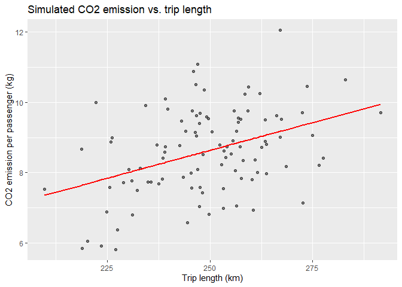

# Introduction to ggplot2
Reiko Okamoto
2025-09-24

## 🖌️ Introduction to ggplot2

> ggplot2 is a system for declaratively creating graphics, based on [The
> Grammar of
> Graphics](https://link.springer.com/book/10.1007/0-387-28695-0). You
> provide the data, tell ggplot2 how to map variables to aesthetics,
> what graphical primitives to use, and it takes care of the details.

#### *Load packages*

``` r
library(tidyverse)
```

    ── Attaching core tidyverse packages ──────────────────────── tidyverse 2.0.0 ──
    ✔ dplyr     1.1.4     ✔ readr     2.1.5
    ✔ forcats   1.0.0     ✔ stringr   1.5.1
    ✔ ggplot2   3.5.2     ✔ tibble    3.3.0
    ✔ lubridate 1.9.4     ✔ tidyr     1.3.1
    ✔ purrr     1.1.0     
    ── Conflicts ────────────────────────────────────────── tidyverse_conflicts() ──
    ✖ dplyr::filter() masks stats::filter()
    ✖ dplyr::lag()    masks stats::lag()
    ℹ Use the conflicted package (<http://conflicted.r-lib.org/>) to force all conflicts to become errors

``` r
library(here)
```

    here() starts at C:/Users/rokamoto/Documents/2025-09-24_intro-to-tidyverse

``` r
library(lubridate)
library(RColorBrewer)
```

## 🔍 Exploring the sample data


- The data originally comes from SNCF, France’s state-owned railway
  operator.
- We’ll use a modified version from [this
  repository](https://github.com/rfordatascience/tidytuesday/tree/main/data/2019/2019-02-26).

#### *Read the data*

``` r
df <- readr::read_csv(here("data", "train-delays.csv"))
```

    Rows: 5462 Columns: 11
    ── Column specification ────────────────────────────────────────────────────────
    Delimiter: ","
    chr (3): service, departure_station, arrival_station
    dbl (8): year, month, journey_time_avg, total_num_trips, avg_delay_all_depar...

    ℹ Use `spec()` to retrieve the full column specification for this data.
    ℹ Specify the column types or set `show_col_types = FALSE` to quiet this message.

``` r
df
```

    # A tibble: 5,462 × 11
        year month service  departure_station       arrival_station journey_time_avg
       <dbl> <dbl> <chr>    <chr>                   <chr>                      <dbl>
     1  2015     1 National AIX EN PROVENCE TGV     PARIS LYON                 182. 
     2  2015     1 National ANGERS SAINT LAUD       PARIS MONTPARN…             98.9
     3  2015     1 National ANGOULEME               PARIS MONTPARN…            156. 
     4  2015     1 National ANNECY                  PARIS LYON                 224. 
     5  2015     1 National ARRAS                   PARIS NORD                  55.6
     6  2015     1 National AVIGNON TGV             PARIS LYON                 161. 
     7  2015     1 National BELLEGARDE (AIN)        PARIS LYON                 164. 
     8  2015     1 National BESANCON FRANCHE COMTE… PARIS LYON                 131. 
     9  2015     1 National BORDEAUX ST JEAN        PARIS MONTPARN…            211. 
    10  2015     1 National BREST                   PARIS MONTPARN…            274. 
    # ℹ 5,452 more rows
    # ℹ 5 more variables: total_num_trips <dbl>, avg_delay_all_departing <dbl>,
    #   avg_delay_all_arriving <dbl>, num_late_at_departure <dbl>,
    #   num_arriving_late <dbl>

- Reading in a CSV file with [`readr`](https://readr.tidyverse.org/)
  (part of the tidyverse) is a typical starting point for many analyses.

#### *Inspect the data dictionary to see the type and description of each variable*

| Variable                  | Type      | Description                     |
|---------------------------|-----------|---------------------------------|
| `year`                    | double    | Year of observation             |
| `month`                   | double    | Month of observation            |
| `service`                 | character | Type of train service           |
| `departure_station`       | character | Name of departure station       |
| `arrival_station`         | character | Name of arrival station         |
| `journey_time_avg`        | double    | Average journey time (min)      |
| `total_num_trips`         | double    | Total number of trips           |
| `avg_delay_all_departing` | double    | Average departure delay (min)   |
| `avg_delay_all_arriving`  | double    | Average arrival delay (min)     |
| `num_late_at_departure`   | double    | Number of trains departing late |
| `num_arriving_late`       | double    | Number of trains arriving late  |

``` r
head(df)
```

    # A tibble: 6 × 11
       year month service  departure_station   arrival_station    journey_time_avg
      <dbl> <dbl> <chr>    <chr>               <chr>                         <dbl>
    1  2015     1 National AIX EN PROVENCE TGV PARIS LYON                    182. 
    2  2015     1 National ANGERS SAINT LAUD   PARIS MONTPARNASSE             98.9
    3  2015     1 National ANGOULEME           PARIS MONTPARNASSE            156. 
    4  2015     1 National ANNECY              PARIS LYON                    224. 
    5  2015     1 National ARRAS               PARIS NORD                     55.6
    6  2015     1 National AVIGNON TGV         PARIS LYON                    161. 
    # ℹ 5 more variables: total_num_trips <dbl>, avg_delay_all_departing <dbl>,
    #   avg_delay_all_arriving <dbl>, num_late_at_departure <dbl>,
    #   num_arriving_late <dbl>

``` r
tail(df)
```

    # A tibble: 6 × 11
       year month service departure_station  arrival_station      journey_time_avg
      <dbl> <dbl> <chr>   <chr>              <chr>                           <dbl>
    1  2018    11 <NA>    TOURCOING          BORDEAUX ST JEAN                285. 
    2  2018    11 <NA>    TOURCOING          MARSEILLE ST CHARLES            305. 
    3  2018    11 <NA>    TOURS              PARIS MONTPARNASSE               76.9
    4  2018    11 <NA>    VALENCE ALIXAN TGV PARIS LYON                      133. 
    5  2018    11 <NA>    VANNES             PARIS MONTPARNASSE              157. 
    6  2018    11 <NA>    ZURICH             PARIS LYON                      242. 
    # ℹ 5 more variables: total_num_trips <dbl>, avg_delay_all_departing <dbl>,
    #   avg_delay_all_arriving <dbl>, num_late_at_departure <dbl>,
    #   num_arriving_late <dbl>

- Each row summarizes information on trips from one station to another
  for a given year and month.
  - The first row captures information on trips from **AIX EN PROVENCE
    TGV** (Aix-en-Provence) to **PARIS LYON** (Paris-Gare-de-Lyon) for
    **JANUARY 2015**.

  - The last row captures information on trips from **ZURICH** to
    **PARIS LYON** for **NOVEMBER 2018**.

## 1️⃣ Histogram

#### *Visualize the distribution of average journey time*

``` r
ggplot(df, aes(x = journey_time_avg)) +
  geom_histogram()
```

    `stat_bin()` using `bins = 30`. Pick better value with `binwidth`.


- The distribution of average journey time is skewed to the right.
- Creating a plot is like making a layer cake 🎂
  - Every plot starts with a `ggplot()` call. Inside, you tell R which
    data set to use.
  - You set up aesthetics with `aes()`. This tells R how to map
    variables in your data to plot components (e.g., x-axis, y-axis,
    colours).
  - You add layers with `geom_*()`. Each geom tells R what type of plot
    to draw (e.g., histogram, scatter plot, line plot).
  - You connect the layers with `+`. This lets you build up the plot,
    piece by piece.

## 2️⃣ Scatter plot

#### *Visualize the relationship between average journey time and average arrival delay*

``` r
df |> 
  dplyr::filter(avg_delay_all_arriving > 0) |>
  ggplot(aes(x = journey_time_avg, y = avg_delay_all_arriving)) +
  geom_point()
```


- It looks as though the variance of delay increases as the average
  journey time increases. For journeys that average \<1 hour, arrival
  delays seem to be \<10 minutes. Meanwhile, for journeys that average 5
  hours, arrival delays seem to be \<30 minutes.

#### *Change the transparency of the points*

``` r
df |> 
  dplyr::filter(avg_delay_all_arriving > 0) |>
  ggplot(aes(x = journey_time_avg, y = avg_delay_all_arriving)) +
  geom_point(alpha = 0.5)
```


#### *Change the size of the points*

``` r
df |> 
  dplyr::filter(avg_delay_all_arriving > 0) |>
  ggplot(aes(x = journey_time_avg, y = avg_delay_all_arriving)) +
  geom_point(size = 0.5)
```


#### *Change the colour of the points*

``` r
df |> 
  dplyr::filter(avg_delay_all_arriving > 0) |>
  ggplot(aes(x = journey_time_avg, y = avg_delay_all_arriving)) +
  geom_point(colour = "red")
```


#### *Add a title and change the axis labels*

``` r
df |> 
  dplyr::filter(avg_delay_all_arriving > 0) |>
  ggplot(aes(x = journey_time_avg, y = avg_delay_all_arriving)) +
  geom_point(alpha = 0.25) +
  labs(
    title = "The longer the ride, the bigger the delay?",
    x = "Average journey time (min)",
    y = "Average arrival delay (min)"
  )
```


## 3️⃣ Bar plot


- Gare du Nord, officially Paris-Nord, is one of Paris’ major terminus
  stations and the busiest railway station in Europe by total passenger
  traffic.

#### *Visualize the number of departures from Paris-Nord in 2015, by destination*

``` r
bar_plot <- df |> 
  dplyr::filter(
    departure_station == "PARIS NORD",
    year == 2015
  ) |> 
  dplyr::group_by(arrival_station) |> 
  dplyr::summarise(n = sum(total_num_trips)) |> 
  ggplot(aes(x = arrival_station, y = n)) +
  geom_col() # OR geom_bar(stat = "identity")

bar_plot
```


#### *Create a horizontal bar plot*

``` r
bar_plot +
  coord_flip()
```


#### *Visualize the number of departures from Paris-Nord in 2015 and 2016, by destination*

``` r
grp_bar_plot <- df |> 
  dplyr::filter(
    departure_station == "PARIS NORD",
    year %in% c(2015, 2016)
  ) |> 
  dplyr::group_by(year, arrival_station) |> 
  dplyr::summarise(n = sum(total_num_trips), .groups = "drop") |> 
  dplyr::mutate(year = factor(year)) |> 
  ggplot(aes(x = arrival_station, y = n, fill = year)) +
  geom_col(position = "dodge") 

grp_bar_plot
```


## 4️⃣ Changing colours

#### *Change the bar colours manually*

``` r
grp_bar_plot +
  scale_fill_manual(values = c("#651C32", "#F2827F"))
```


- Use `scale_fill_*()` for bar, box, and violin plots.
- Use `scale_colour_*()` for scatter and line plots.

#### *Change the bar colours using the `RColorBrewer` package*

``` r
display.brewer.all()
```


``` r
grp_bar_plot +
  scale_fill_brewer(palette = "Pastel1")
```


## 5️⃣ Line plot


#### *Visualize how the monthly number of trips from Paris to Brest changes throughout the year*

``` r
df <- df |> 
  mutate(ymd = lubridate::make_date(year, month)) 

df |> 
  dplyr::filter(
    departure_station == "PARIS MONTPARNASSE",
    arrival_station == "BREST"
  ) |> 
  ggplot(aes(x = ymd, y = total_num_trips)) +
  geom_line()
```


#### *Visualize how the monthly number of trips from Paris to multiple cities in Brittany changes throughout the year*

- Force the y-axis to start at 0.
- Add year-month labels to the x-axis and rotate them.
- Apply a different
  [theme](https://ggplot2.tidyverse.org/reference/ggtheme.html).

``` r
brittany_cities <- c("RENNES", "BREST", "QUIMPER")  

brittany_plot <- df |> 
  dplyr::filter(
    departure_station == "PARIS MONTPARNASSE",
    arrival_station %in% brittany_cities
  ) |> 
  ggplot(aes(x = ymd, y = total_num_trips, colour = arrival_station)) +
  geom_line() +
  scale_y_continuous(limits = c(0, NA), expand = c(0, 0)) +
  scale_x_date(date_breaks = "4 months", date_labels = "%b %Y") +
  labs(
    title = "Monthly number of trips from Paris to cities in Brittany",
    colour = "Arrival station",
    x = "",
    y = "Monthly number of trips"
  ) +
  theme_minimal() +
  theme(axis.text.x = element_text(angle = 45, hjust = 1))

brittany_plot
```


- Choose your scale function based on the type of data:
  `scale_*_continuous()` for numbers, `scale_*_discrete()` for
  categories, and `scale_*_date()` for dates.
- Use `theme()` to adjust non-data elements of your plot like titles,
  labels, and grid lines.
  - When combining it with a built-in theme like `theme_minimal()`, make
    sure to call the build-in theme first or else it may override the
    custom settings you specified with `theme()`.

## 6️⃣ Overlaying graphs

``` r
# 1. simulate data
n <- 100
sim_df <- tibble(
  x1 = rnorm(n, mean = 250, sd = 15),   # trip length in km
  e  = rnorm(n),                        # random noise
  y  = 0.035 * x1 + e                   # CO2 emission increases with distance
) %>%
  select(-e) 

# 2. plot raw data
ggplot(sim_df, aes(x = x1, y = y)) +
  geom_point(alpha = 0.5) +
  labs(
    x = "Trip length (km)",
    y = "CO2 emission per passenger (kg)",
    title = "Simulated CO2 emission vs. trip length"
  )
```


``` r
# 3. fit linear model
mod1 <- lm(y ~ x1, data = sim_df)

# 4. add predicted values to tibble
sim_df <- sim_df |> 
  mutate(y_hat = predict(mod1))

# 5. overlay line of best fit
ggplot(sim_df, aes(x = x1, y = y)) +
  geom_point(alpha = 0.5) +
  geom_line(aes(y = y_hat), colour = "red", linewidth = 1) +
  labs(
    x = "Trip length (km)",
    y = "CO2 emission per passenger (kg)",
    title = "Simulated CO2 emission vs. trip length"
  )
```



``` r
# 6. check model coefficients
coef(mod1)
```

    (Intercept)          x1 
     0.71865048  0.03166282 

## 7️⃣ Saving our masterpieces

``` r
ggsave(
  filename = "brittany.png",
  plot = brittany_plot
)
```

    Saving 7 x 5 in image

- If you don’t specify the `plot` argument, by default, the function
  will save the last plot displayed.

## ⭐ Other types of plots

#### *Create a box plot to visualize the distribution of the monthly number of trips from Paris-Gare-de-Lyon to each international destination*

``` r
df |> 
  dplyr::filter(
    departure_station == "PARIS LYON",
    service == "International"
  ) |> 
  ggplot(aes(x = arrival_station, y = total_num_trips)) +
  geom_boxplot()
```


#### *Change one line of code to display the distributions as a violin plot*

``` r
df |> 
  dplyr::filter(
    departure_station == "PARIS LYON",
    service == "International"
  ) |> 
  ggplot(aes(x = arrival_station, y = total_num_trips)) +
  geom_violin()
```


> While a [box plot](https://en.wikipedia.org/wiki/Box_plot) shows a
> summary statistics such as mean/median and interquartile ranges, the
> [violin plot](https://en.wikipedia.org/wiki/Violin_plot) shows the
> full distribution of the data. The violin plot can be used in
> multimodal data (more than one peak).

## ⭐ Laying out panels in a grid

#### *Visualize how the monthly number of trips from Paris to multiple cities in Brittany changes over time*

To make it easier to compare patterns across years, use faceting to
create subplots (one for each year).

``` r
df |> 
  dplyr::filter(
    departure_station == "PARIS MONTPARNASSE",
    arrival_station %in% brittany_cities
  ) |> 
  ggplot(aes(x = month, y = total_num_trips, color = arrival_station)) +
  geom_line() +
  facet_wrap(vars(year))
```


## ⭐ Modify the theme

Theme elements are non-data components of a plot, which include things
like the background colour, text size, font, and grid lines. These
changes don’t alter the underlying data; they only adjust the appearance
of the plot. We’ve already seen how to modify the theme to change the
angle of the axis labels. Now let’s explore some of the other elements
we can customize.

``` r
brittany_plot + # base plot
  theme(
    # bold plot title and increase font size
    plot.title = element_text(face = "bold", size = 16), 
    # colour x-axis label red and increase font size
    axis.title.x = element_text(size = 14, color = "red"),
    # colour y-axis label blue and increase font size
    axis.title.y = element_text(size = 14, color = "blue"),
    # colour background green
    plot.background = element_rect(fill = "green"),
    # colour major grid lines purple
    panel.grid.major = element_line(color = "purple", linewidth = 0.5)
  )
```


- I don’t think this aesthetic makes the plot easier to read, but it
  does demonstrate just how customizable ggplot2 is 🤠

## 📚 References

- [From data to Viz \| Find the graphic you need
  (data-to-viz.com)](https://www.data-to-viz.com/)
- [Be Awesome in ggplot2: A Practical Guide to be Highly Effective - R
  software and data visualization - Easy Guides - Wiki -
  STHDA](http://www.sthda.com/english/wiki/be-awesome-in-ggplot2-a-practical-guide-to-be-highly-effective-r-software-and-data-visualization)
- [Function reference • ggplot2
  (tidyverse.org)](https://ggplot2.tidyverse.org/reference/)
- [Modify components of a theme — theme • ggplot2
  (tidyverse.org)](https://ggplot2.tidyverse.org/reference/theme.html)
